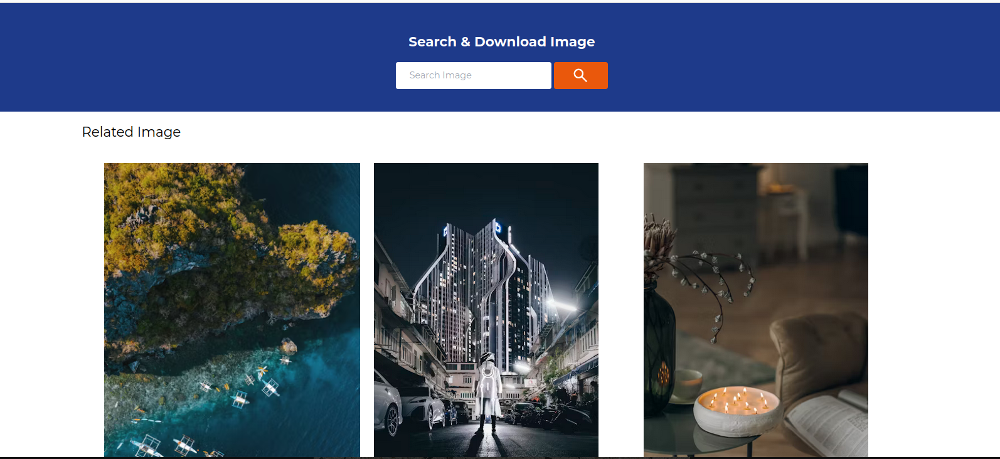

# Image Search App
   fetch The data from the api show the image
   Based on the Input



## Tech stack
   <li>HTML</li>
   <li>CSS</li>
   <li>JS</li>


## INSTALLIZATION

```code
 npm install
 npm run dev
```


## License

This repository is licensed under the [MIT License](LICENSE).

The MIT License is a permissive open-source license that allows you to use, modify, and distribute this repository for both commercial and non-commercial purposes. You are free to do so as long as you include the original license text and disclaimers. For more details, please read the [MIT License](LICENSE).

**TL;DR:** You can use, modify, and distribute this repository freely, but you must include the original license text.